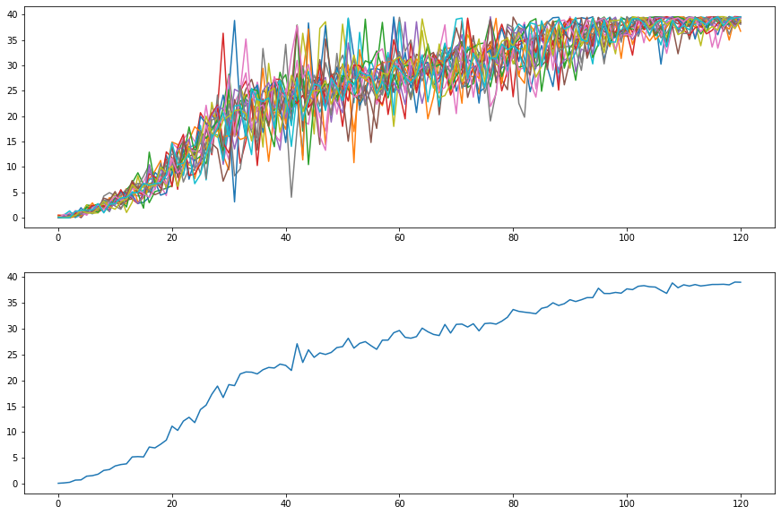
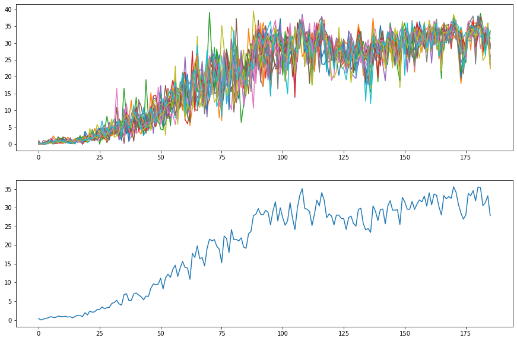

# Continuous Control with Reinforcement Learning

## Section 1: Getting Started
### Intro
This repository provides code and result of deep reinforcement learning algorithms trained to solve the Reacher Environment.

<div style="text-align: center;">

</div>

In this environment, a double-jointed arm can move to target locations. A reward of +0.1 is provided for each step that the agent's hand is in the goal location. Thus, the goal of your agent is to maintain its position at the target location for as many time steps as possible.

The observation space consists of 33 variables corresponding to position, rotation, velocity, and angular velocities of the arm. Each action is a vector with four numbers, corresponding to torque applicable to two joints. Every entry in the action vector should be a number between -1 and 1.

There are two different versions of this problem implemented in two Unity environments:

1. The first version contains a single agent.
2. The second version contains 20 identical agents, each with its own copy of the environment.

We focus on the latter, but the code provided can be used to solve the first environment as well.
To solve this environment we must:
```
The agents must get an average score of +30 (over 100 consecutive episodes, and over all agents). Specifically,
```

TLDR: This goal is achieved by both the implemented algorithms (PPO and DDPG). The results can be observed in Section 4.


### Dependencies
```
torch==1.0.0
numpy==1.19.5
unityagents==0.4.0
```
### Relevant Folders
- `assets` contains the trained weight checkpoints organised in folders per algorithm
- `figures` contains the figures later shown in this document.
- `src` contains the implementation of the models

### Relevant Files
- `PPO_Continous_learning.ipynb` Is the notebook used to train the PPO model.
- `DDPG_Continous_learning.ipynb` Is the notebook used to train the DDPG model.
- `pretrained_demo.ipynb` Is the notebook used to load the pretrained models.

## Section 2: Download the Unity Environment
For this project, you will not need to install Unity - this is because we have already built the environment for you, and you can download it from one of the links below. You need only select the environment that matches your operating system:

#### Version 1: One (1) Agent
- Linux: click [here](https://s3-us-west-1.amazonaws.com/udacity-drlnd/P2/Reacher/one_agent/Reacher_Linux.zip)
- Mac OSX: click [here](https://s3-us-west-1.amazonaws.com/udacity-drlnd/P2/Reacher/one_agent/Reacher.app.zip)
- Windows (32-bit): click [here](https://s3-us-west-1.amazonaws.com/udacity-drlnd/P2/Reacher/one_agent/Reacher_Windows_x86.zip)
- Windows (64-bit): click [here](https://s3-us-west-1.amazonaws.com/udacity-drlnd/P2/Reacher/one_agent/Reacher_Windows_x86_64.zip)
#### Version 2: Twenty (20) Agents
- Linux: click [here](https://s3-us-west-1.amazonaws.com/udacity-drlnd/P2/Reacher/Reacher_Linux.zip)
- Mac OSX: click [here](https://s3-us-west-1.amazonaws.com/udacity-drlnd/P2/Reacher/Reacher.app.zip)
- Windows (32-bit): click [here](https://s3-us-west-1.amazonaws.com/udacity-drlnd/P2/Reacher/Reacher_Windows_x86.zip)
- Windows (64-bit): click [here](https://s3-us-west-1.amazonaws.com/udacity-drlnd/P2/Reacher/Reacher_Windows_x86_64.zip)

Then, place the file in the p2_continuous-control/ folder in the DRLND GitHub repository, and unzip (or decompress) the file.

(For Windows users) Check out this [link](https://support.microsoft.com/en-us/help/827218/how-to-determine-whether-a-computer-is-running-a-32-bit-version-or-64) if you need help with determining if your computer is running a 32-bit version or 64-bit version of the Windows operating system.

**NB To use the code as is, please import the environments in the unity folder**

## Section 3: Implemented Algorithms
This repositeory provides the Training code, learned model and Training demonstration of the following algorithms:

### Proximal Policy Optimization
This used implementation of the PPO algorithm uses the following modules:
- `network.py` implements the `PPOPolicy` class comprised of separate Actor and Critic Networks. The exploratory standard deviation that alters the chosen actions during the training phase are made with trainable parameters. These trainable paramenters represent the logarithm of the noise std. This guarantees that the once exponentiated the std is strictly positive (it is unlikely that the parameters goes to -inf).
- `agent.py` implements `PPOAgent` class that encompasses the behaviour of the agent (performing an action on the environment, running a test episode on the environment).
- `trainer.py` Implements the `PPOTrainer` containing all the functionality for training an agent through the PPO algorithm. It builds a rollout of execution to then compute advantage and return. The rollout is used to build a dataset containing advantage, return, actions and log_prob of the steps taken. Those are then used to train the agent policy for multiple epochs.
- `buffer.py` Implements the `Batcher` module that generates the batches from the collected rollout dataset.

#### This Formulation of the PPO uses:
- An actor of hidden layer sizes `[256, 128]`
- A critic of hidden layer sizes `[256, 128]`
- The hidden units use `ReLU` for both networks but `Tanh` for the output layer of the Actor to guarantee an action space $\in [-1, 1]$. For the critic there is no output transfer function.

#### The training implementation uses:
- Generalized Advantage estimation with $\lambda$ = `0.9`
- learning rate for actor and critic of `1e-4` while it uses `1e-3` for training the std parameters.
- The policy updates use `10` training epochs with minibatches of size `512`
- The PPO update uses $\varepsilon$ = `0.2` providing substantial but stable updates. The coefficient of the entropy bonus uses $\beta$ = `1e-3` guaranteeing an explorative behaviour up to the end of the training.
- We use a discount factor $\gamma$ = `0.99` to improve the longtermism of the agent.

### Deep Deterministic Policy Gradient
This used implementation of the PPO algorithm uses the following modules:
- `network.py` implements `DDPGPolicy` network and its components `Actor` and `Critic`.
- `agent.py` implements `DDPGAgent` class that encompasses the behaviour of the agent (performing an action on the environment, running a test episode on the environment).
- `trainer.py` Implements the `DDPGTrainer` containing all the functionality for training an agent through the DDPG algorithm. It builds a training buffer of execution. The buffer is sampled to train the agent policy for multiple epochs. The trained policy belongs to a clone of the trained agent. The agent is improved by applying soft update from the cloned agent.
- `buffer_replay.py` implements `ReplayBuffer` and `PrioritizedReplayBuffer` who collect the data of coming from the training rollouts. The main difference is how the training samples are collected from the buffers. In the first case it's just a FIFO queue uniformly sampled. In the second a priority value is assigned on each sample. The samples are finally collected based on that priority value. The priority value is updated after each sample.


#### This Formulation of the DDPG uses:
- An actor of hidden layer sizes `[256, 128]`
- A critic of hidden layer sizes `[256, 128]`
- In the Actor the hidden units use `ReLU` and `Tanh` for the output layer to guarantee an action space $\in [-1, 1]$. For the critic there is no output transfer function, but the hidden units use `LeakyReLU` reducing the insurgence of dead neurons during training.

#### The training implementation uses:
- learning rate for actor and critic of `1e-4`.
- We implement 2 different versions of the ReplayBuffer: with and without priority.
- We use a discount factor $\gamma$ = `0.99` to improve the longtermism of the agent.
- The Target network is updated from the local network with $\tau$ = `0.01`

## Section 4: Results
The results of the training can be observed in the folders:
- `assets` for the trained models
- `figures` contain the training plots. The same that you will see below.

If you wish to see the trained agents in execution please use the `pretrained_demo.ipynb` notebook. It will load the models and run one episode of 1000 steps max.
### PPO
PPO reaches convergence quite fast, but it can result very sensitive to the hyperparameter values. In particular, too large learning rate or $\varepsilon$ values may lead to unstable learning procedures. The agent could start decreasing it's performance with time.
That said, once well tuned the algorithm is quite fast in executing each learning episode and in its learning progress.
With PPO the 20 Reacher problem could be stopped after 120 episodes of training. However, it could still continue improving.
#### Proximal Policy Optimization - Early Stopped


As shown below, the algorithm reaches the theoretical limit of the environment lacking the chance of further improvement. Here we can see that with less than 150 episodes the agent has very low variance in the execution performance.

#### Proximal Policy Optimization - Convergence


As can be seen below the agent trained with PPO behave quite nicely even when exploration variance is still present. That said in the execution tests we performed we can still notice some non smooth movements in the agent behaviour in some robot configurations.
#### PPO - One training episode
<div style="text-align: center;">
</div>

### DDPG - Early stopped
DDPG had a slower evolution. However, the different agents behaved more uniformly during the training than in the PPO case (There are many less individual spikes). That said the algorithm reached the target after 200 episodes.

#### DDPG base-buffer-replay


To improve the training we tried implement a priority mechanisms for the ReplayBuffer based on sample utilization.
It did not seem to help particularly and slowed down the model execution significantly (20.42s/episode -> 63.82s/episode during training.).

#### DDPG priority-buffer-replay


## Section 5: Future improvements
### Environment/Problem
- Continuously decrease the radius of the target sphere with the improvement of the performance. This will generate robots to reach accurately every point of the workspace.
- Adding obstacles in the path to teach the algorithm to perform some obstacle avoidance behaviour. Perhaps this can be performed with an hierarchical agent (e.g. one generates the naive next step of the trajectory, another uses it as input to created a obstacle avoiding trajectory).
- Increse the speed of the target after convergence (but keeping the max speed of the robot constant). I am curious to see how the agent adapts to fastly moving targets. It could be interesting to provide a forecasting module to the network capable to anticipate the target's behaviour.
- Introducing a window of temporal entropy coefficient to the reward. I notice some little jumps in the execution of the environment. Perhaps this can avoid these jumpy movements in the local space.
- I see how some agent like this one could be useful to learn "fast" trajectory planning for the robots. It would be interesting to observe the behaviour together with a robot teleoperation system. In particular, I think that robustness to noisy input can be a desirable aspect. Thus adding some noise to the observation space could make the policy more robust.

### PPO
Possible improvements to the PPO algorithm are:
- Testing additional forms of Normalization. For example it is proven that Normalizing the advantage on the minibatch level provides some benefit to the learning.
- Annealing the $\varepsilon$, $\beta$ and learning rates of the optmization may provide additional stability to the learning procedure. having the learning rates all set to `1e-3` led to a reverse of the perfomance once close to convergence. Reducing their value while the training progresses may avoid this problem.
- having the variance as output of the actor network rather than separate paramenters. This could generate specialized values for each observation and speed-up the exploration.

### DDPG
- Changing the way priorities are calculated on the PriorityReplayBuffer. Some mechanisms based on the MSE of the Advantage estimation of the state or using the action probability to weight priories. Alternatively one could consider removing too similar samples in the buffer with some clustering mechanisms.
- One interesting mechanisms would be using a self-supervised learning approach to learn a representation of the state-action-space that is more and more friendly to the agent to master.
- Test alternative Exploration approaches to the Ornstein-Uhlenbeck process.
- Faster approaches to compute the priority weights. Currently it slows down the training significantly

### Both
DDPG and PPO have both advantages and disadvantages. It would be interesting to try training the policy with both in different modalities:
- Sequentially use DDPG to bootstrap the policy with previously collected samples.
- Using the two approaches in parallel alternate steps (but Not sure on how to perform the update) could help condensate information from off-policy executions and on-policy improvements
