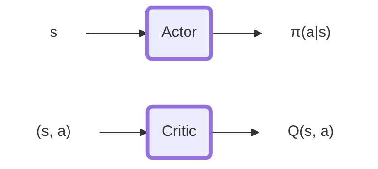
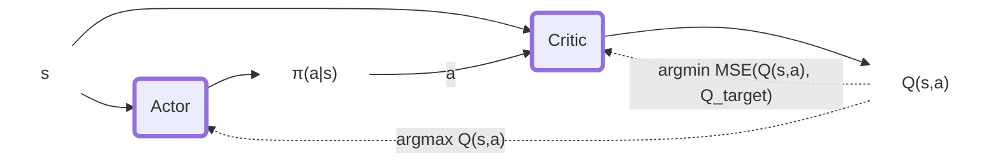
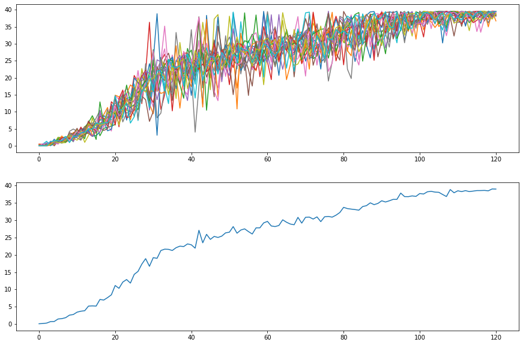
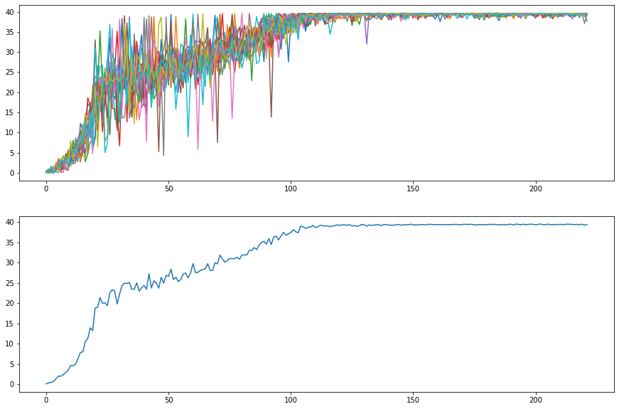
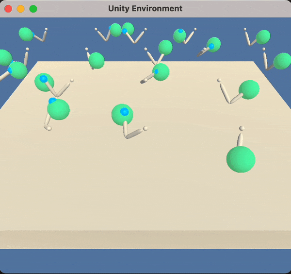
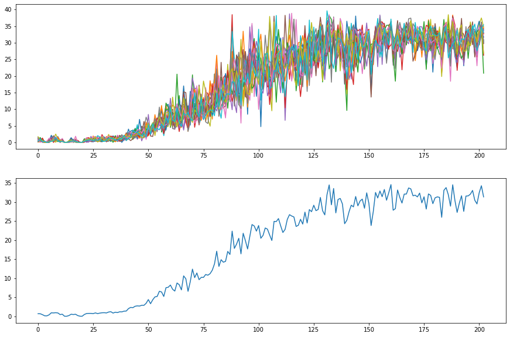

# Report Continous Control Submission

The code in this repository implements processes to train and execute autonomous agents to solve the Reacher Environment.

In this environment, a double-jointed arm can move to target locations. A reward of +0.1 is provided for each step that the agent's hand is in the goal location. Thus, the goal of your agent is to maintain its position at the target location for as many time steps as possible.

The observation space consists of 33 variables corresponding to position, rotation, velocity, and angular velocities of the arm. Each action is a vector with four numbers, corresponding to torque applicable to two joints. Every entry in the action vector should be a number between -1 and 1.

#### Reacher Environment with 20 agents
<div style="text-align: center;">

</div>

In this repository the Proximal Policy Optimization and Deep Determinstic Policy Gradient are implemented to solve the environment.
The code makes available 2 classes for agents (`PPOAgent`, `DDPGAgent`) each of those implement their own Actor-Critic Policies (`PPOPolicy`, `DDPGPolicy`) with their specific characteristics. Finally, the code implements the training protocols for soliving the problem `PPOTrainer` and `DDPGTrainer`.
Thus, it implements the following Deep Reinforcement Mechanisms:

## PPO
PPO is an on-policy algorithm based on policy gradient. Here it is implemented in its actor-critic formulation. The actor calculates the action from the state while the Critic $\pi(a|s)$ generates the value of the state $V(s)$.
This implementation uses a parametrized log standard deviation used for exploring the environment. Specifically the the parameters are used on a log scale so that (after exponentiation) we guarantee strictly positive values.
This implementation uses Generalized Advantage Estimation (GAE) for estimating Advantage values
$$\hat{A}_{\lambda} = \delta_t + (\gamma\lambda)\cdot\delta_{t+1} + (\gamma\lambda)^{2}\cdot\delta_{t+2} + ... + (\gamma\lambda)^{T-1}\cdot\delta_{T-1}$$
$with$
$$ \delta_t = r_t + \gamma V(s_{t+1}) - V(s_{t})$$
where $V(s)$ is calculated through the Critic network.
The loss used for the optimization is the following:
$$L_{PPO} = L^\varepsilon_{Actor}(\theta_{Actor}) + \frac{1}{2}L_{Critic}(\theta_{Critic}) - \beta * H(\pi(\cdot|s))$$
The actor loss is the classical PPO loss
$$
L^\varepsilon_{Actor} = -min(\frac{\pi_{\theta}(a_{t}|s_{t})}{\pi_{\theta_{old}}(a_{t}|s_{t})} \cdot \hat{A}, clip(\frac{\pi_{\theta}(a_{t}|s_{t})}{\pi_{\theta_{old}}(a_{t}|s_{t})}, 1-\varepsilon, 1+\varepsilon)\cdot \hat{A})
$$
The Critic Loss $L_{Critic}$ is the MSE between the value estimated and the Discounted return $R_t = V_{\theta^{old}_{Critic}}(s_t) + A_t$:
$$L_{Critic} = MSE(R_t, V_{\theta_{Critic}}(s_t))$$
Finally, $H$ is the entropy bonus used to encourage the explorative behaviour influencing the parameters used to calculate the explorative standard deviation on the action space.
### Hyper-Parameters
For this algorithm, we will have the following hyper-parameters:
```python
actor_hidden_sizes = [256, 128]
critic_hidden_sizes = [256, 128]
actor_hidden_transfer_function = nn.ReLU
actor_output_transfer_function = nn.Tanh
critic_transfer_function = nn.ReLU
# ---------------------------
gae_lambda = 0.9 # lambda parameter used for the GAE
gamma = .99 # discount rate used to calculate advantage and return
epsilon_clip = 0.2 # clip used in the PPO surrogate
actor_learning_rate = 1e-4 # learning rate of the actor
critic_learning_rate = 1e-4 # learning rate of the critic
std_learning_rate = 1e-3 # learning rate of the std parameters
batch_size = 512 # size of the minibatches
n_epochs = 10 # optimization epochs while updating the policy
beta = 1e-3 # entropy coefficient
```
## DDPG

Deep Deterministic Policy Gradient is an off-policy actor-critic Deep RL algorithm that interconnects the input and outputs of the two networks to select better policy and better value estimation iteratively. $\varepsilon$ $\pi(a|s)$.
Specifically, The actor maps state to action ($s$ -> $\pi(a|s)$) and the critic maps state action pairs to Q returns ($(s,a)$ -> $\hat{Q}(s,a)$).

The policy is updated optimizing the two losses for Actor and Critc:
$$L_{Critic} = MSE(Q_{expected}, Q_{target})$$
$$L_{Actor} = -\hat{Q}(s, \pi(a|s))$$
where

$Q_{expected} = \hat{Q}(s, a)$ is the Q-value of next state-action.

$Q_{next} = \hat{Q}(s',\pi(a'|s'))$ is the Q-value of next state-action.

$Q_{target} = r + (\gamma \cdot Q_{next} \cdot (1-terminal))$ is the discounted Q.

The whole update procedure can be summarized in the following graph:



The policy update is not applied directly on the policy to optimize. DDPG applies the update on a local copy of the policy. The "target" policy is updated through soft-update from the "local" policy:
$$θ_{target} = τ\cdotθ_{local} + (1 - τ)\cdotθ_{target}$$

Being DDPG an off-policy algorithm we use a Buffer Replay structure to serve training samples to the algorithm. This helps to maintain more uniformity in the training samples.
Here 2 versions are implemented: `BufferReplay` and `PriorityBufferReplay`. The first samples the history uniformly the second does it using a priority value related to the amount of information provided by the sample.

### Hyper-Parameters
```python
actor_hidden_sizes = [256, 128]
critic_hidden_sizes = [256, 128]
actor_hidden_transfer_function = nn.ReLU
actor_output_transfer_function = nn.Tanh
critic_transfer_function = nn.LeakyReLU
# ---------------------------
actor_learning_rate = 1e-4
critic_learning_rate = 1e-4
tau = 0.01
gamma = 0.99
```


### Results
The results of the training can be observed in the folders:
- `assets` for the trained models
- `figures` contain the training plots. The same that you will see below.

If you wish to see the trained agents in execution please use the `pretrained_demo.ipynb` notebook. It will load the models and run one episode of 1000 steps max.
#### PPO
PPO reaches convergence quite fast, but it can result very sensitive to the hyperparameter values. In particular, too large learning rate or $\varepsilon$ values may lead to unstable learning procedures. The agent could start decreasing it's performance with time.
That said, once well tuned the algorithm is quite fast in executing each learning episode and in its learning progress.
With PPO the 20 Reacher problem could be stopped after 120 episodes of training. However, it could still continue improving.
##### Proximal Policy Optimization - Early Stopped


As shown below, the algorithm reaches the theoretical limit of the environment lacking the chance of further improvement. Here we can see that with less than 150 episodes the agent has very low variance in the execution performance.

##### Proximal Policy Optimization - Convergence


As can be seen below the agent trained with PPO behave quite nicely even when exploration variance is still present. That said in the execution tests we performed we can still notice some non smooth movements in the agent behaviour in some robot configurations.
##### PPO - One training episode
<div style="text-align: center;">
</div>

#### DDPG - Early stopped
DDPG had a slower evolution. However, the different agents behaved more uniformly during the training than in the PPO case (There are many less individual spikes). That said the algorithm reached the target after 200 episodes.

##### DDPG base-buffer-replay


To improve the training we tried implement a priority mechanisms for the ReplayBuffer based on sample utilization.
It did not seem to help particularly and slowed down the model execution significantly (20.42s/episode -> 63.82s/episode during training.).

##### DDPG priority-buffer-replay


### Future improvements
#### Environment/Problem
- Continuously decrease the radius of the target sphere with the improvement of the performance. This will generate robots to reach accurately every point of the workspace.
- Adding obstacles in the path to teach the algorithm to perform some obstacle avoidance behaviour. Perhaps this can be performed with an hierarchical agent (e.g. one generates the naive next step of the trajectory, another uses it as input to created a obstacle avoiding trajectory).
- Increse the speed of the target after convergence (but keeping the max speed of the robot constant). I am curious to see how the agent adapts to fastly moving targets. It could be interesting to provide a forecasting module to the network capable to anticipate the target's behaviour.
- Introducing a window of temporal entropy coefficient to the reward. I notice some little jumps in the execution of the environment. Perhaps this can avoid these jumpy movements in the local space.
- I see how some agent like this one could be useful to learn "fast" trajectory planning for the robots. It would be interesting to observe the behaviour together with a robot teleoperation system. In particular, I think that robustness to noisy input can be a desirable aspect. Thus adding some noise to the observation space could make the policy more robust.

#### PPO
Possible improvements to the PPO algorithm are:
- Testing additional forms of Normalization. For example it is proven that Normalizing the advantage on the minibatch level provides some benefit to the learning.
- Annealing the $\varepsilon$, $\beta$ and learning rates of the optmization may provide additional stability to the learning procedure. having the learning rates all set to `1e-3` led to a reverse of the perfomance once close to convergence. Reducing their value while the training progresses may avoid this problem.
- having the variance as output of the actor network rather than separate paramenters. This could generate specialized values for each observation and speed-up the exploration.

#### DDPG
- Changing the way priorities are calculated on the PriorityReplayBuffer. Some mechanisms based on the MSE of the Advantage estimation of the state or using the action probability to weight priories. Alternatively one could consider removing too similar samples in the buffer with some clustering mechanisms.
- One interesting mechanisms would be using a self-supervised learning approach to learn a representation of the state-action-space that is more and more friendly to the agent to master.
- Test alternative Exploration approaches to the Ornstein-Uhlenbeck process.
- Faster approaches to compute the priority weights. Currently it slows down the training significantly

### Both
DDPG and PPO have both advantages and disadvantages. It would be interesting to try training the policy with both in different modalities:
- Sequentially use DDPG to bootstrap the policy with previously collected samples.
- Using the two approaches in parallel alternate steps (but Not sure on how to perform the update) could help condensate information from off-policy executions and on-policy improvements
